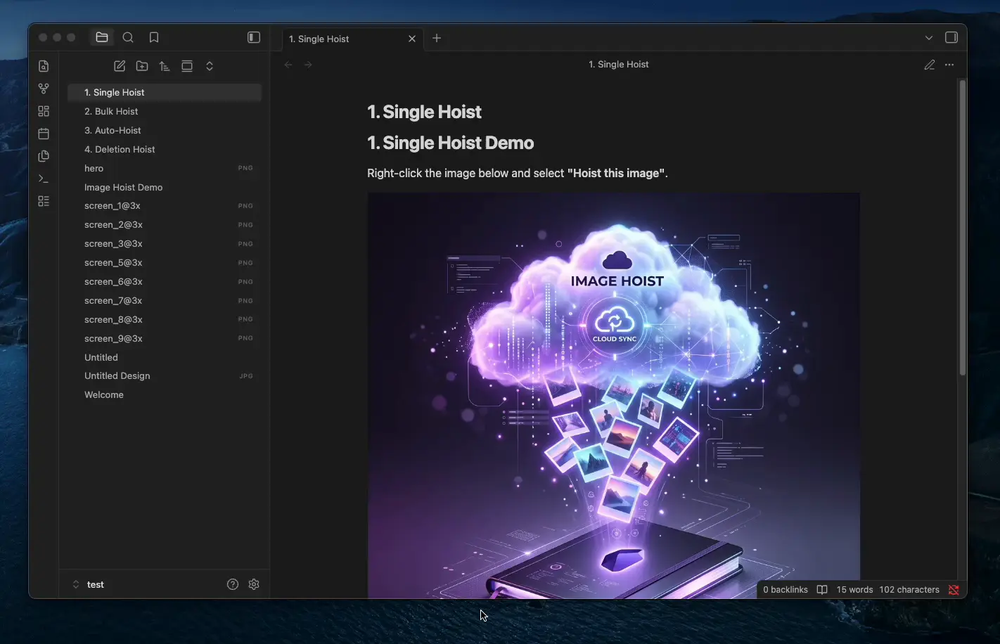
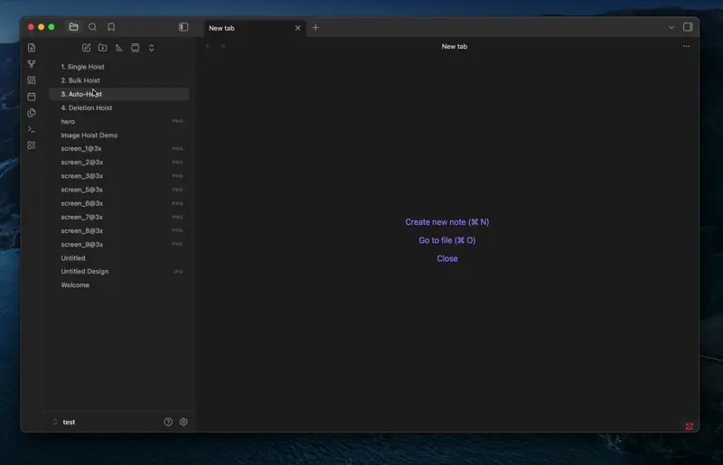
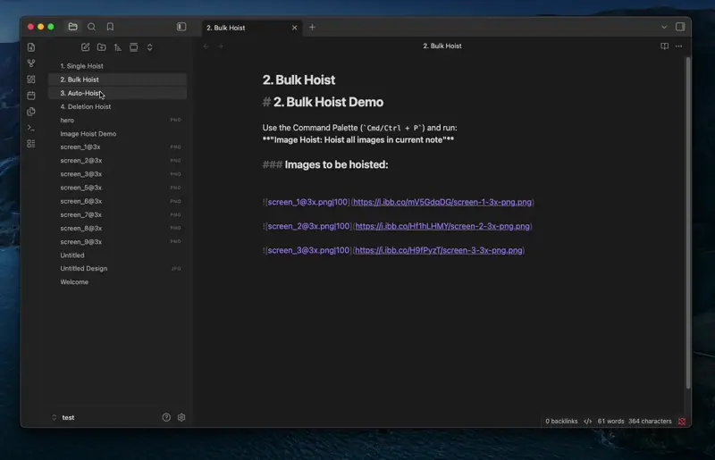
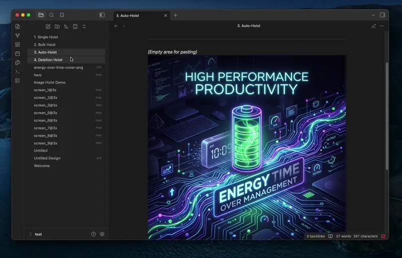

# Image Hoist for Obsidian

[Leer en español](README_es.md)


Automatically move your local images to the cloud ([ImgBB](https://imgbb.com/)) to keep your Obsidian vault lightweight and your notes easy to share. No more broken links when copy-pasting to emails or blogs!

## 🚀 Features

- **Save Space & Sync Faster**: Stop storing heavy images locally.
- **Auto-Hoist**: Paste an image, and it uploads automatically in the background.
- **Smart Reuse**: It recognizes duplicate images and reuses the link.
- **One-Click Cleanup**: Hoist an entire old note full of local images at once.

## 🛠️ Quick Start

1. Install the plugin in Obsidian.
2. Get a free API key from [ImgBB](https://api.imgbb.com/) and paste it into the settings.

## 📖 How to use it

> ⚠️ **IMPORTANT**: This plugin currently **ONLY works when your editor is in Source Mode**.

### 1. Hoist One Local Vault Image
The easiest way is to **right-click the image** in your editor and select **Hoist this image**. You can also put your cursor on the image line and run the command from the Command Palette.



### 2. Bulk Hoist Local Vault Images (The Magic Button)
**Right-click anywhere in your note** and select **Hoist all images in this note** for the fastest bulk action. You can also run the command **Hoist all images in current note** from the Command Palette (`Cmd/Ctrl + P`).



### 3. Auto-Hoist on Paste
Just drag and drop or paste an image into your note—it goes straight to the cloud (if enabled in settings).



### 4. Delete Local Files
When you hoist an image, the local file is automatically deleted from your vault to save space (if enabled in settings).



## 💻 Development

If you want to contribute or build the plugin from source:

1. Clone this repository into your vault's plugin folder: `<vault>/.obsidian/plugins/obsidian-image-hoist`
2. Install dependencies:
   ```bash
   npm install
   ```
3. Start the dev server with watch mode:
   ```bash
   npm run dev
   ```
4. Create a production build:
   ```bash
   npm run build
   ```

## 🤝 Contributing

Contributions are welcome! Feel free to open an issue or submit a pull request to suggest improvements, report bugs, or add new features.

## 📄 License

This project is licensed under the [MIT License](LICENSE).
